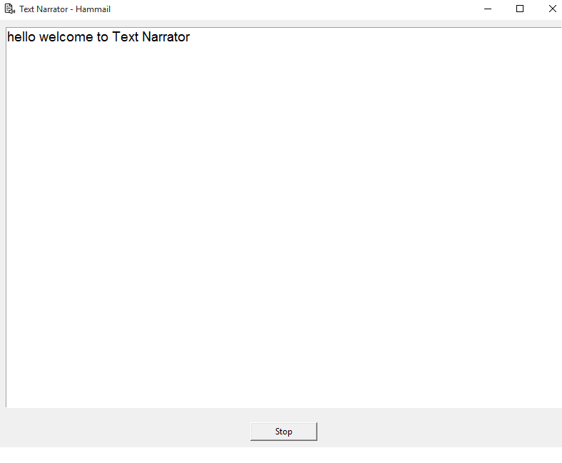

# 🗣️ Text Narrator - Hammail

A simple **Text-to-Speech (TTS) Narrator** built with **Python**, **Tkinter**, and **pyttsx3**.  
It allows you to type or paste text, then narrates it aloud using your computer’s speech engine.  

---

## ✨ Features
- 📝 Write or paste any text in the editor.  
- 🔊 Click **Speak** to narrate the text.  
- ⏹️ Option to stop narration instantly (if enabled in code).  

- 💻 Cross-platform (Windows, macOS, Linux).  

---

## 🚀 How to Run

1. **Clone the repository**  
   ```bash
   git clone https://github.com/Hammail-Riaz/text-narrator.git
   cd text-narrator

2. You can get the ready made .exe file for use.
Or Get the exe from releases section.

---


## ⚡ Requirements
- Python 3.8+
- pyttsx3
- tkinter (comes pre-installed with Python)

---

## 🎨 Screenshots (Optional)


---

## 📜 License

For license information you can visit **License.txt**.

